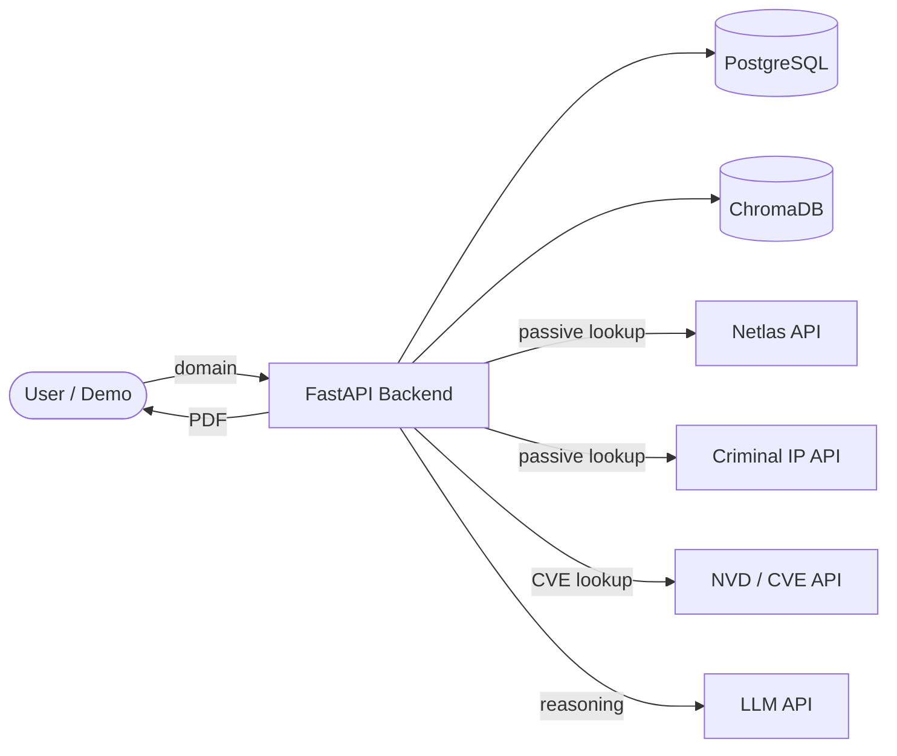
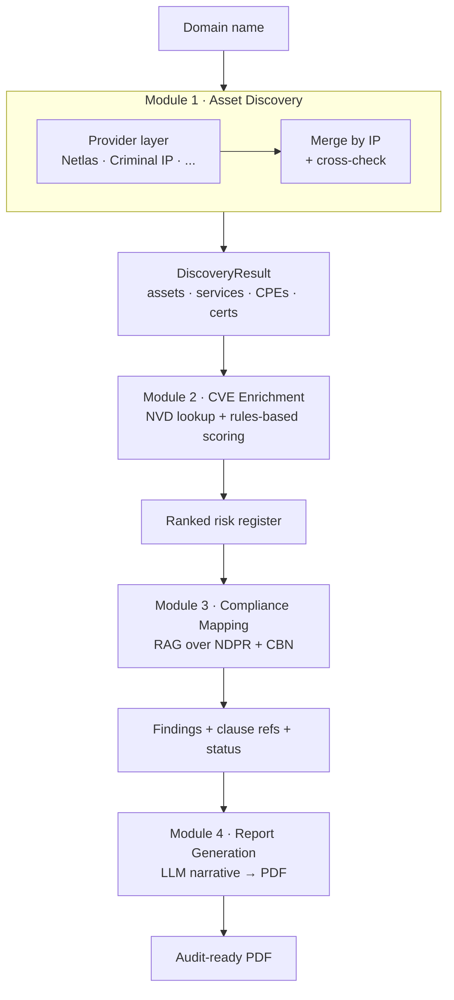
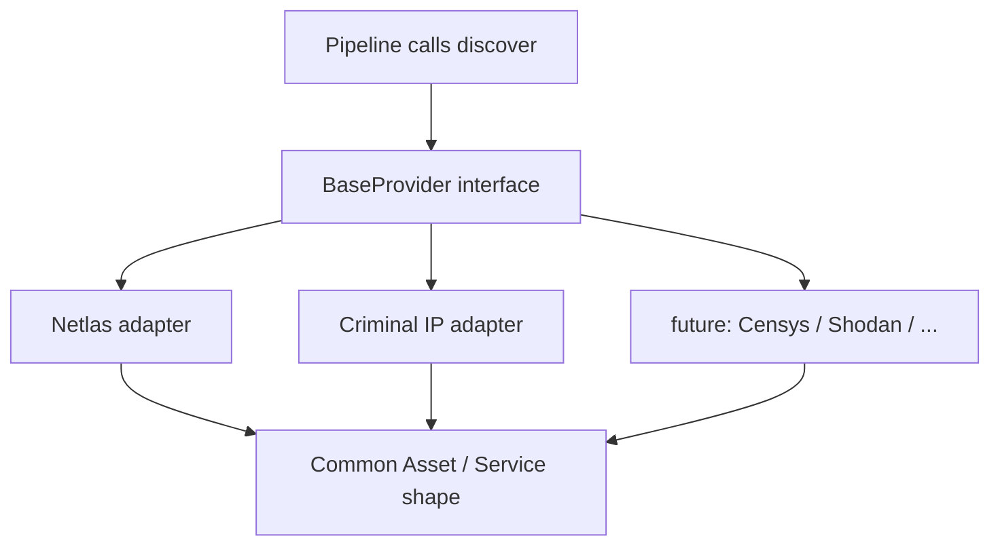

# 02 · Architecture

> **Status:** Living document · **Version:** 1.0 · **Last updated:** 2026-07
>
> Describes *how* the system is structured. Driven by `01_REQUIREMENTS.md`. If architecture changes,
> update this file before changing code, and record the decision in `12_DECISION_LOG.md`.

---

## 1. Guiding principles

1. **Single instance.** The whole POC runs on one modest machine. No cluster, no multi-region.
2. **Sequential pipeline.** Four modules, each consuming the previous one's output. No branching.
3. **Provider independence.** The pipeline never calls a data provider directly; adapters normalise
   every provider into one shape. (ADR-002.)
4. **Passive only.** No module ever sends active scan traffic to a target. (ADR-001, `08_SECURITY.md`.)
5. **Separation for future scale.** Modules are cleanly bounded so any one could later become its own
   service without a rewrite — but we do **not** build that separation infrastructure now.

## 2. System context

Everything inside `API`, `DB`, `VEC` is hosted on our single instance. `NETLAS`, `CIP`, `NVD`, `LLM`
are external services called over their APIs — not hosted, not scanned.

## 3. Pipeline (control + data flow)

Each arrow is a well-defined object hand-off (see `03_DOMAIN_MODEL.md`). Modules are synchronous and
run in order; there is no queue or async orchestration in the POC.

## 4. Component responsibilities

| Component | Responsibility | Notes |
|---|---|---|
| FastAPI backend | HTTP endpoints; orchestrates the four modules | Single app |
| Module 1 (discovery) | Domain → normalised assets, via provider adapters | Prototyped |
| Module 2 (enrichment) | Services → CVEs + contextual risk scores | Rules engine, not LLM |
| Module 3 (compliance) | Findings → regulatory clause mappings | RAG; the differentiator |
| Module 4 (report) | All findings → PDF | LLM narrative from structured data |
| PostgreSQL | Persist assets, findings, reports | Single DB |
| ChromaDB | Vector store for regulatory documents | File-based, on-instance |
| Provider adapters | Translate each provider's response into `Asset`/`Service` | Pluggable |

## 5. Provider abstraction (key pattern)

The pipeline depends only on `BaseProvider`. Providers are registered in one place (`registry.py`) and
enabled by the presence of an env-var API key. A provider with no key is skipped. Detail in
`07_BACKEND_ARCHITECTURE.md`.

## 6. Communication patterns

- **Sync only** for the POC. Each module is a function call returning the next object.
- **No queues, no workers, no background jobs** — deliberately deferred (would be needed for the
  scheduled-scan feature, which is out of scope).
- External calls are plain HTTPS requests with caching to conserve free-tier quota.

## 7. Scaling strategy (future — NOT built now)

Documented so the boundaries are intentional, not accidental. None of this is in the POC.

- Split modules into independent services behind the same interfaces.
- Introduce a job queue (e.g. Celery/Redis or a cloud queue) for scheduled/continuous scanning.
- Multi-tenant data isolation for a managed-service offering.
- Regional hosting if Nigerian data-residency requirements apply to the productised version.

## 8. Technology decisions (summary — see `12_DECISION_LOG.md` for rationale)

| Area | Choice | ADR |
|---|---|---|
| Backend framework | FastAPI (Python) | ADR-003 |
| Vector store | ChromaDB (POC), Milvus deferred | ADR-005 |
| Data providers | Netlas + Criminal IP first, pluggable | ADR-002, ADR-004 |
| Vulnerability source | NVD/CVE (free) | ADR-006 |
| Risk scoring | Deterministic rules engine, not LLM | ADR-007 |
| Frameworks (POC) | NDPR + CBN only | ADR-008 |

## 9. Key tradeoffs accepted

- **Single instance over scalable infra** — correct for a POC; revisit only if productised.
- **Sync pipeline over async/queue** — simpler, sufficient for one-at-a-time demo scans.
- **Indexed provider data over live scanning** — legal safety and simplicity, at the cost of some data
  freshness (acceptable for POC; noted in `13_RISK_REGISTER.md`).
