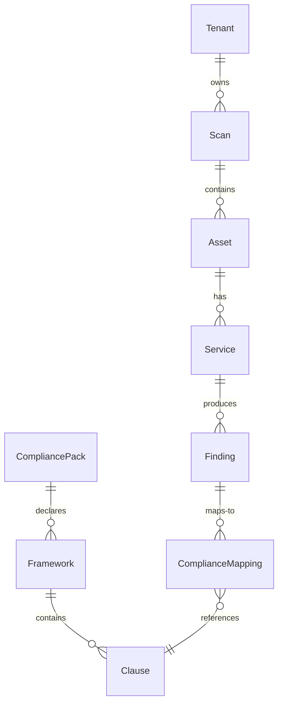

# 03 · Domain Model

> **Status:** Living · The core objects and the pack interface. These are the contracts between modules.
> Mirrors `m516/models.py`. If code and this diverge, reconcile and note why.

## 1. Engine entities (universal — no pack/sector knowledge)

### Service
| Field | Type | Notes |
|---|---|---|
| port / protocol | int / str | e.g. 25 / tcp |
| name | str? | e.g. smtp, https |
| product / version | str? | e.g. MailEnable / 10.57 |
| cpe | str? | preferred key for CVE lookup |
| banner | str? | raw banner |
Derived: `version_string` = "{product} {version}" when both present.

### Asset
| Field | Type | Notes |
|---|---|---|
| ip / hostname / domain | str? | identity |
| services[] | Service[] | open services |
| asn / as_name / isp | str? | hosting context |
| country | str? | ISO code |
| is_behind_waf | bool | CDN/WAF edge flag |
| cert_subject / cert_issuer / cert_valid_until | — | certificate |
| sources[] | set | provenance (providers) |
| last_seen | datetime? | freshness |
| tenant_id | str? | **nullable — tenant-aware, unused in POC** |
Derived: `is_locally_hosted` = country matches pack's home country AND not behind_waf;
`cert_is_expired` = valid_until < now.

### DiscoveryResult
`domain`, `assets[]` (merged by IP), `subdomains`, `errors[]`. `merge_asset()` combines by IP,
unioning services + sources.

### Finding (Module 2)
| Field | Notes |
|---|---|
| asset / service | refs |
| cve_ids[] / cvss | from NVD |
| contextual_score / severity | rules engine output |
| explanation | plain-English note |
| compliance[] | ComplianceMapping[] (added by Module 3) |
| tenant_id | nullable |

### ComplianceMapping (Module 3 — populated from the pack)
| Field | Notes |
|---|---|
| framework | e.g. NDPR, CBN (**from pack, not hard-coded**) |
| clause | specific article/section ref |
| status | compliant / partial / non-compliant |
| remediation | guidance |

## 2. The Compliance Pack interface (the extension point)

A pack is a self-contained unit of sector/country knowledge. The engine knows only this interface;
it never knows "Nigeria" or "CBN". Full authoring spec in `21_COMPLIANCE_PACKS.md`.

```
CompliancePack:
  id: str                     # e.g. "nigeria-banking"
  display_name: str           # "Nigeria — Banking"
  home_country: str           # "NG"  (drives is_locally_hosted)
  sector: str                 # "banking"
  frameworks: Framework[]     # the regulations in play
  report_labels: dict         # e.g. which regulator the report addresses

Framework:
  id: str                     # "NDPR", "CBN"
  display_name: str
  issuing_body: str           # "NITDA", "CBN"
  documents: DocumentRef[]    # source texts to ingest/embed
  clauses: Clause[]           # optional structured clause metadata

Clause:
  ref: str                    # "NDPR Art. 2.6", "CBN 4.2"
  title: str
  summary: str
  finding_hints: str[]        # keywords/finding-types this clause relates to (aids retrieval)
```

**Engine ↔ pack rule:** the engine calls `pack.frameworks`, embeds `framework.documents`, and for each
finding retrieves clauses + asks the LLM to map. Swapping packs changes the knowledge, never the code.

## 3. Relationships



## 4. Business rules

- BR-1 WAF/CDN asset is never treated as locally-hosted origin.
- BR-2 A service needs `version_string` or `cpe` to be CVE-eligible.
- BR-3 Contextual score is deterministic/explainable — never LLM. (ADR-007)
- BR-4 A finding maps to 0..n clauses.
- BR-5 Report content traces to a real finding. No fabrication.
- BR-6 Provenance preserved through merges.
- BR-7 **No engine code references a specific framework/country/sector.** (Golden rule.)
- BR-8 `is_locally_hosted` compares against the loaded pack's `home_country`, not a hard-coded "NG".

## 5. Bounded contexts

Discovery · Risk · Compliance (pack-driven) · Reporting. Conceptual for POC; one app, four modules.
